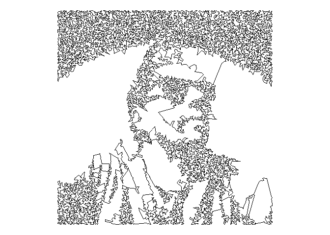

README
================

## Line draw inspired in Traveling Salesman Problem

 

Traveling Salesman Problem in
[Wikipedia](https://en.wikipedia.org/wiki/Travelling_salesman_problem)

### Load libraries

``` r
library(imager)
```

    ## Loading required package: magrittr

    ## 
    ## Attaching package: 'imager'

    ## The following object is masked from 'package:magrittr':
    ## 
    ##     add

    ## The following objects are masked from 'package:stats':
    ## 
    ##     convolve, spectrum

    ## The following object is masked from 'package:graphics':
    ## 
    ##     frame

    ## The following object is masked from 'package:base':
    ## 
    ##     save.image

``` r
library(dplyr)
```

    ## 
    ## Attaching package: 'dplyr'

    ## The following objects are masked from 'package:stats':
    ## 
    ##     filter, lag

    ## The following objects are masked from 'package:base':
    ## 
    ##     intersect, setdiff, setequal, union

``` r
library(ggplot2)
library(scales)
library(TSP)
```

### Load the image to convert

``` r
# Point to the place where your image is stored
file <- "me.jpg"
```

### convert to grayscale

``` r
# Load, convert to grayscale, filter image (to convert it to bw) and sample
load.image(file) %>% 
  grayscale() %>%
  threshold("45%") %>% 
  as.cimg() %>% 
  as.data.frame()  %>% 
  sample_n(18000, weight=(1-value)) %>% 
  select(x,y) -> data
```

### TSP distances

``` r
# Compute distances and solve TSP (it may take a minute)
as.TSP(dist(data)) %>% 
  solve_TSP(method = "arbitrary_insertion") %>% 
  as.integer() -> solution
# Rearrange the original points according the TSP output
data_to_plot <- data[solution,]
```

### Plot the linedraw

``` r
# A little bit of ggplot to plot results
ggplot(data_to_plot, aes(x,y)) +
  geom_path() +
  scale_y_continuous(trans=reverse_trans())+
  coord_fixed()+
  theme_void()
```

<!-- -->

``` r
# Do you like the result? Save it! (Change the filename if you want)
#ggsave("Me.png", dpi=600, width = 4, height = 5)
```
